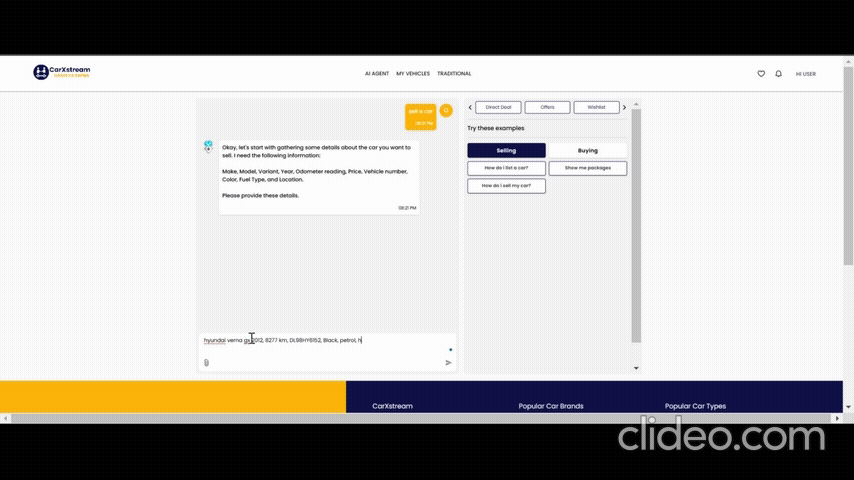
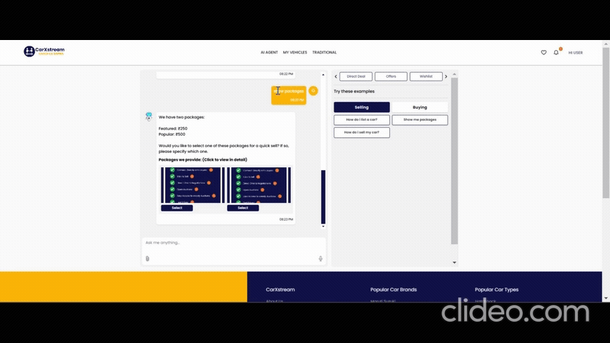
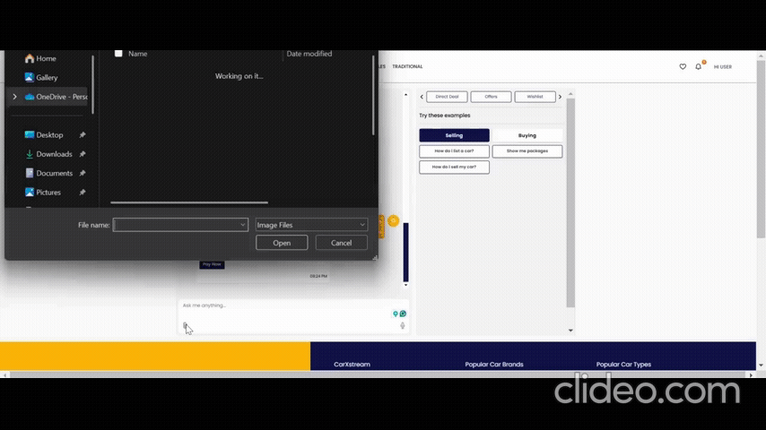
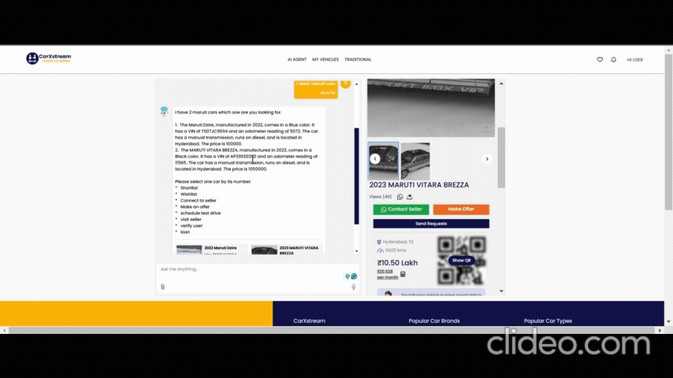
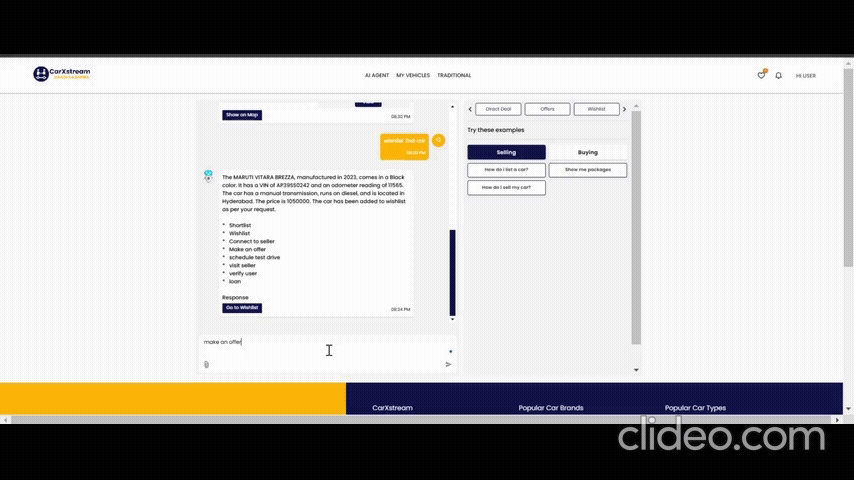

# CarXStream AI Agent 🚗🤖✨

Welcome to **CarXStream AI Agent** – an innovative, multilingual AI-powered system that transforms the car buying and selling experience. Our solution automates complex processes such as price comparisons, deal-making, wishlist management, test drive scheduling, and loan processing, seamlessly integrating across WhatsApp, Web, and Mobile platforms. This project combines cutting-edge AI with scalable cloud infrastructure to deliver efficiency, accuracy, and a superior user experience in automotive transactions. 🚀💡

 

---

## Table of Contents 📚
1. [Project Overview](#project-overview)
2. [Architecture & Components](#architecture--components)
3. [Features](#features)
   - [Master Agent](#master-agent)
   - [Sell Tool (ai-agent-sell)](#sell-tool-ai-agent-sell)
   - [Buy Tool (ai-agent-buy)](#buy-tool-ai-agent-buy)
   - [Price Recommender (ai-agent-price)](#price-recommender-ai-agent-price)
   - [Additional Agents](#additional-agents)
4. [Demo Videos](#demo-videos)
5. [Tech Stack & Tools](#tech-stack--tools)
6. [License](#license)
7. [Contact](#contact)

---

## Project Overview 🚀🌟

CarXStream AI Agent is a comprehensive platform designed to revolutionize car transactions. Leveraging advanced AI, natural language processing, and cloud-based machine learning, our system automates and optimizes every step of the car buying and selling lifecycle. With tools for real-time price comparisons, dynamic pricing, and intelligent matchmaking between buyers and sellers, CarXStream AI Agent empowers users with timely, data-driven insights and streamlines automotive processes. 📊💼

---

## Architecture & Components 🏗️🔧

Our system is built on a modular, multi-agent architecture that ensures robustness, scalability, and flexibility:

- **Master Agent**: Acts as the central command center, orchestrating and coordinating specialized sub-agents. It manages task delegation, error handling, and seamless communication between components. ⚙️💬
  
- **Sub-Agents**:
  - **Sell Tool (ai-agent-sell)**: Handles the complete selling process—from car uploads and price evaluations to premium selling package selection. 🚗💰
  - **Buy Tool (ai-agent-buy)**: Facilitates intelligent car searches, shortlisting, wishlist management, offer-making, test drive scheduling, loan processing, and user verification. 🔍📋
  - **Price Recommender (ai-agent-price)**: Utilizes AWS SageMaker AutoPilot to generate accurate, real-time price recommendations based on market trends and historical data. 📈🤖
  - **Additional Agents**: Support customer service, image handling, car removal, and connecting sellers with potential buyers. 🤝📸

Each component operates independently yet contributes to a cohesive, end-to-end solution that enhances the overall user experience and operational efficiency. 🔗✨

---

## Features 🌟🎯

### Master Agent
- **Centralized Control**: Orchestrates the execution of all sub-agents for a unified, smooth workflow. 🔄
- **Intelligent Workflow Management**: Leverages advanced language models, prompt engineering, and cloud services (AWS Lambda) to deliver self-correcting, human-like responses. 🧠💡
- **Seamless Integration**: Combines Python, OpenAI, LangGraph, and ElasticSearch to optimize operations and maintain robust security protocols. 🔐

### Sell Tool (ai-agent-sell)
- **Car Upload & Price Setting**: Sellers can easily upload car details and specify their desired selling price. 📤💵
- **Market Comparison & Price Recommendation**: Instantly compares the listed price with real-time market data and offers dynamic price suggestions using AWS SageMaker AutoPilot. 🔍📊
- **Premium Selling Packages**: Provides optional packages to boost visibility and expedite the selling process. 🚀💎
- **User-Friendly Interface**: Designed with simplicity in mind, ensuring a smooth and efficient selling experience. 👍✨

### Buy Tool (ai-agent-buy)
- **Smart Car Search**: Empowers users to search for cars using natural language queries (e.g., "Show me Toyota cars"). 🔎🚙
- **Feature-Rich Interaction**: Offers functionalities such as shortlisting, wishlist management, connecting with sellers, making offers, scheduling test drives, applying for loans, and user verification. 📋✅
- **Smooth Browsing Experience**: Incorporates automatic pagination and continuous result loading for hassle-free navigation. 🖱️💨
- **Enhanced User Experience**: Optimizes every interaction for clarity, speed, and relevance. 🌟🔄

### Price Recommender (ai-agent-price)
- **Real-Time Dynamic Pricing**: Utilizes AWS SageMaker AutoPilot to deliver accurate, data-driven price recommendations. ⏱️💹
- **Automated Optimization**: Features hyperparameter tuning and continuous endpoint deployment to adapt to changing market conditions. 🔄⚙️
- **Actionable Market Insights**: Merges historical data with current trends to provide strategic pricing recommendations, enabling users to make informed decisions. 📈📚

### Additional Agents
Beyond the core functionalities, our system includes a suite of additional agents designed to further enhance the user experience and streamline operations:
- **Customer Service Agent**:  
  Delivers 24/7 automated support by handling user queries, resolving common issues, and providing timely, context-aware responses using natural language processing. 🤖💬
- **Image Handling Agent**:  
  Manages the upload, processing, and optimization of car images to ensure high quality, fast loading, and a visually appealing presentation of car listings. 📸✨
- **Car Removal Agent**:  
  Automates the removal of outdated or sold car listings to maintain an accurate and trustworthy inventory. 🚮✅
- **Seller Connection Agent**:  
  Bridges the communication gap between sellers and potential buyers, facilitating real-time interactions, negotiations, and queries to streamline transactions and boost engagement. 🔗🤝

---

## Demo Videos 🎥📽️

Experience CarXStream AI Agent in action:
- **Selling Process**: Watch how sellers upload car details, set prices, and choose premium packages.  
  
  
- **Package Selection**: See the process of selecting enhanced selling packages.  
  
  
- **Image Upload**: A smooth demonstration of the image handling feature.  
  
  
- **Buying & Wishlist Management**: Explore the smart search, shortlisting, and wishlist functionalities.  
  
  
- **Offer Making**: A detailed look at the offer-making process.  
  

---

## Tech Stack & Tools 🛠️💻

### Master Agent
- **Programming Language:** Python 🐍
- **AI Frameworks:** OpenAI, LangGraph, LangChain 🤖
- **Data Processing & Orchestration:** ElasticSearch, AWS Lambda, Prompt Engineering 🔍⚡
- **Deployment & Containerization:** Docker, AWS 📦☁️

### Sell Tool (ai-agent-sell)
- **Backend:** Python 🐍
- **AI & Machine Learning:** LangGraph, AWS SageMaker AutoPilot 🤖💡
- **Data Storage:** ElasticSearch, MySQL 🗄️
- **APIs & Integrations:** Google Cloud Storage (for image uploads), RESTful APIs 🌐

### Buy Tool (ai-agent-buy)
- **Backend:** Python 🐍
- **AI & NLP:** LangChain, OpenAI 🤖🗣️
- **Database:** ElasticSearch, DynamoDB 🗄️
- **User Interaction:** Features like pagination, shortlisting, and wishlist management 📋✅

### Price Recommender (ai-agent-price)
- **Machine Learning:** AWS SageMaker AutoPilot 🤖📊
- **Integration:** AWS Lambda for real-time predictions and continuous deployment ⏱️🚀

### Additional Technologies
- **Communication & Integration:** WhatsApp API, Web & Mobile App frameworks 📱💬
- **DevOps:** Docker, GitHub Actions, AWS CloudFormation 🐳⚙️

### Other Skills & Tools
- **Database Management:** MySQL, Postgres 🗄️
- **Data Analysis Tools:** Excel, Power Query 📊
- **Advanced Proficiencies:** NLP, Generative AI (Transformers, RAG, OpenAI), Prompt Engineering, Agentic AI 🧠🔥

---

## License 📄

This project is licensed under the **MIT License** – please see the [LICENSE](LICENSE) file for full details. 📜

---

## Contact 📬

For questions, feedback, or collaboration opportunities, please reach out:

- **Email:** [riachoudhari9@gmail.com](mailto:riachoudhari9@gmail.com) 📧
- **GitHub:** [Ria2810](https://github.com/Ria2810) 💻
- **LinkedIn:** [Ria Choudhari](https://www.linkedin.com/in/ria-choudhari-a681b5200) 🔗

---

>“Innovation distinguishes between a leader and a follower.” – Steve Jobs

Harness the power of AI and data to transform car transactions and drive the future of mobility! 🚀🌟
